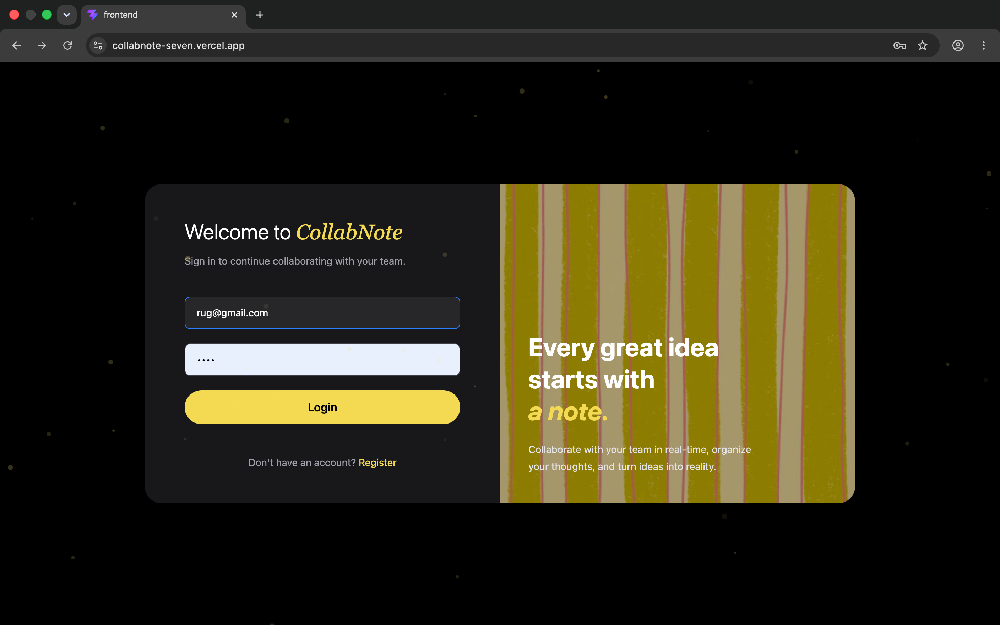
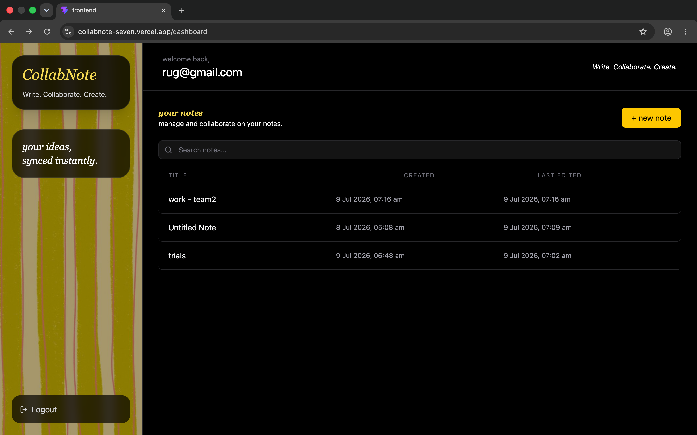
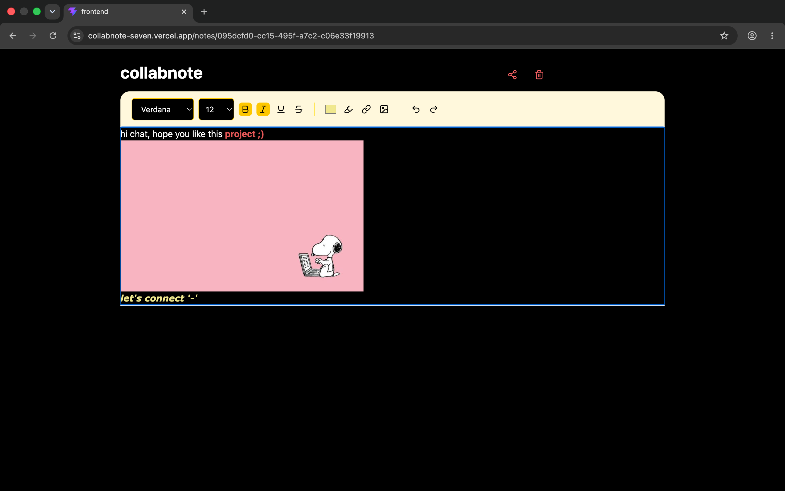
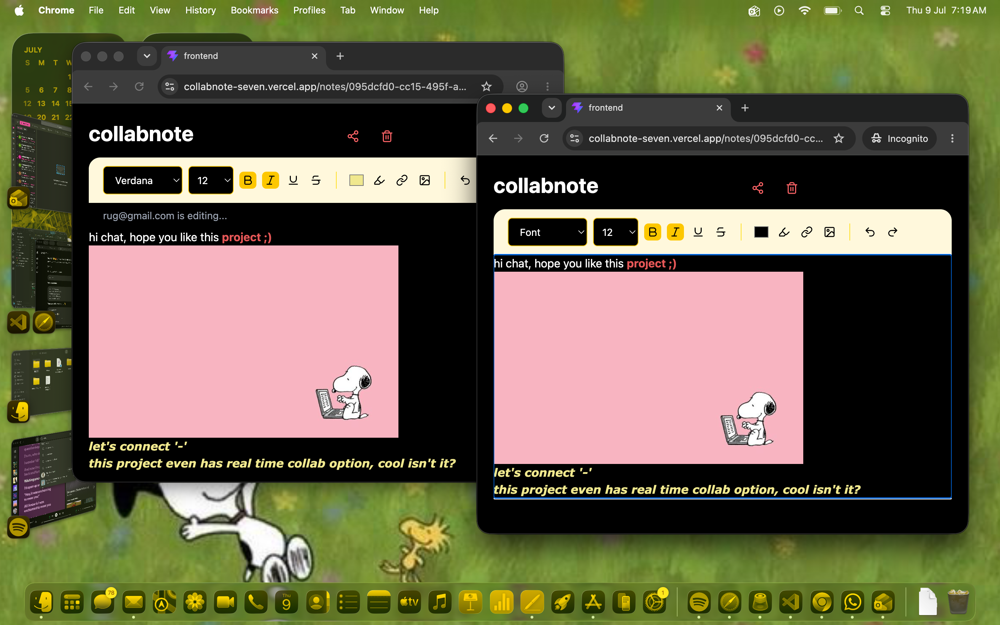

# CollabNote


A Notion-inspired collaborative note-taking platform that enables users to create, edit, and manage rich-text documents with real-time synchronization. The application combines secure authentication, rich-text editing, cloud storage, and WebSocket-powered collaboration into a production-ready full-stack application.

---

# Live Demo

**Application:** https://collabnote-seven.vercel.app

**Repository:** https://github.com/rugdesai/collabnote

---

# Preview

## Authentication

<p align="center">

</p>

JWT-based authentication with secure user registration, login, and protected application routes.

---

## Dashboard

<p align="center">

</p>

A centralized workspace for creating, organizing, and managing personal notes with persistent PostgreSQL storage.

---

## Rich Text Editor

<p align="center">

</p>

Built with Tiptap, supporting:

- Rich text formatting
- Headings
- Lists
- Font customization
- Text colors
- Highlights
- Hyperlinks
- Image embedding
- Automatic saving

---

## Real-Time Collaboration

<p align="center">

</p>

Multiple users can edit the same document simultaneously using Socket.IO-powered real-time synchronization.

---

# Features

## Authentication

- User registration and login
- JWT-based authentication
- Protected API routes
- Secure password hashing with bcrypt

## Notes Management

- Create, edit, and delete notes
- Auto-save functionality
- Persistent PostgreSQL storage
- Personal workspace management

## Rich Text Editing

- Tiptap Editor
- Rich text formatting
- Headings and lists
- Font customization
- Text highlighting
- Hyperlinks
- Image embedding
- Responsive editing experience

## Real-Time Collaboration

- Live document synchronization
- Multi-user editing sessions
- Socket.IO communication
- Shared collaborative workspace

## Cloud Integration

- Cloudinary image uploads
- PostgreSQL database
- Environment-based configuration
- Production deployment

---

# Tech Stack

## Frontend

- React
- TypeScript
- Vite
- Tailwind CSS
- Tiptap Editor
- Socket.IO Client
- Axios

## Backend

- Node.js
- Express.js
- TypeScript
- PostgreSQL
- Prisma ORM
- Socket.IO
- JWT Authentication
- bcrypt

## Deployment

- Vercel
- Docker
- Cloudinary

---

# System Architecture

```text
                 React + TypeScript
                        │
                        ▼
                 Express REST API
                ┌────────┴────────┐
                ▼                 ▼
      PostgreSQL + Prisma   Socket.IO Server
                │
                ▼
         Cloudinary Storage
```

---

# Database Design

Core entities include:

- User
- Note
- Collaboration
- Invite

The schema supports document ownership, collaborative editing, user invitations, and shared access management.

---

# Local Setup

```bash
git clone https://github.com/rugdesai/collabnote.git

cd collabnote

npm install

npm run dev
```

---

# Project Structure

```text
collabnote/
├── backend/
│   ├── config/
│   ├── controllers/
│   ├── middleware/
│   ├── prisma/
│   ├── routes/
│   ├── services/
│   └── server.ts
│
└── frontend/
    ├── components/
    ├── hooks/
    ├── pages/
    ├── services/
    └── editor/
```

---

# Highlights

- Real-time collaborative editing using WebSockets
- Rich-text editor powered by Tiptap
- Secure JWT-based authentication
- PostgreSQL with Prisma ORM
- Cloudinary image management
- Dockerized application
- Fully deployed production application
- Modular full-stack architecture

---

# Future Improvements

- AI writing assistant
- Collaborative cursors
- Comments and mentions
- Document version history
- Granular access control
- Offline editing support

---
